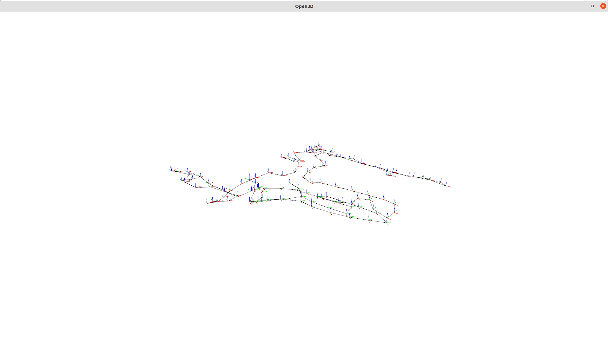

# Python reading pbstream file

Export the proto description from cartographer

## Getting started

1. Clone [cartographer](https://github.com/cartographer-project/cartographer) project to ``<CARTOGRAPHER_PATH>``
2. export all proto files to python``find CARTOGRAPHER_PATH -name *.proto -printf "%P\n" -exec protoc -I=CARTOGRAPHER_PATH --python_out=. {} \;``

## Print info

``python main.py info --inputfile=<*.pbstream file>`` to print a summary about a file. 

This is an example output for the ``b3-2016-04-05-14-14-00.bag`` used in this
[demo](https://google-cartographer-ros.readthedocs.io/en/latest/assets_writer.html)

```
Info about: ./b3-2016-04-05-14-14-00.bag.pbstream
Serialization Header-Format Version: 2
Fieldname                            	#Entries
Field: pose_graph                    	     1 entry
Field: all_trajectory_builder_options	     1 entry
Field: submap                        	   136 entries
Field: node                          	 21679 entries
Field: trajectory_data               	     1 entry
Field: imu_data                      	305059 entries

Process finished with exit code 0
```

## Plot trajectory

``python main.py trajectory --inputfile=<*.pbstream file>`` plots the trajectory as open3d


